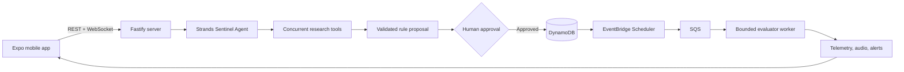

# Strands Sentinel

## Built with AWS Strands Agents SDK

**Strands Sentinel is an autonomous monitoring assistant built with the [AWS Strands Agents SDK](https://strandsagents.com/docs/user-guide/quickstart/typescript/).** It turns a natural-language request into a verified, persistent watcher that can monitor live data, evaluate conditions, and alert the user when something important happens.

Instead of repeatedly spending model tokens on polling, Sentinel uses a two-tier design: a Strands agent understands the user's intent, researches the target, and creates the monitoring rule; a deterministic evaluator then runs that rule in the background at near-zero inference cost.

## Why Strands

The Strands Agents SDK is the project's agent runtime. Sentinel uses it to provide:

- A model-driven conversational agent with a dedicated system prompt and lifecycle.
- Native custom tools for stocks, crypto, prediction markets, RSS, web research, technical indicators, and public Telegram channels.
- Concurrent tool execution for faster reconnaissance.
- Persistent conversation memory through `SessionManager`.
- Structured handoff from agent-generated plans to validated TypeScript rule schemas.
- Flexible model providers, including Amazon Bedrock and OpenAI-compatible models.
- Focused agentic evaluators for conditions that require semantic reasoning.

The server uses the TypeScript package [`@strands-agents/sdk`](https://www.npmjs.com/package/@strands-agents/sdk).

## What Sentinel Does

1. The user describes something to monitor in plain language.
2. The Strands agent clarifies the target, condition, cadence, and alert sound.
3. Specialized tools verify the live source and collect a baseline.
4. Sentinel synthesizes a typed rule with one or more sub-sentinels.
5. A human approval card prevents deployment without confirmation.
6. The deterministic engine evaluates the approved rule in the background.
7. Matching conditions create realtime dashboard updates, telemetry, audio alerts, and optional push notifications.

Example request:

> Monitor Bitcoin and alert me with a chime when its price rises above my target.

## Features

- Natural-language creation of autonomous monitoring tasks.
- Live research across financial, web, RSS, prediction-market, and public-channel sources.
- Multi-condition `AND`, `OR`, `NOT`, and nested condition trees.
- Human-in-the-loop approval before a watcher becomes active.
- Realtime chat and event delivery over authenticated WebSockets.
- Active, paused, triggered, and archived watcher lifecycles.
- Telemetry history, alert history, audio feedback, and haptics.
- Durable execution leases, cooldowns, retries, and idempotency.
- Production execution on DynamoDB, S3, EventBridge Scheduler, and SQS.
- An explicitly selected local development mode using SQLite and the embedded evaluator.

## Architecture



This is the production architecture. Production startup refuses local infrastructure, SQLite, embedded evaluation, missing S3 session storage, and missing scheduler/worker configuration. Local SQLite mode remains available only when explicitly selected for development. Amazon Bedrock is configured separately as the production model provider.

## Technology Stack

| Layer | Technology |
|---|---|
| Agent runtime | AWS Strands Agents SDK for TypeScript |
| Models | Amazon Bedrock or an OpenAI-compatible provider |
| Mobile | React Native, Expo, TypeScript, NativeWind |
| Server | Node.js, Fastify, TypeScript, WebSockets |
| Validation | Zod and generated JSON Schema |
| Authentication | Clerk |
| Development persistence | SQLite |
| Production persistence | DynamoDB and S3 |
| Production execution | EventBridge Scheduler and SQS |

## Repository Layout

```text
Strands/
├── mobile/   # Expo mobile application
├── server/   # Fastify API, Strands agents, tools, and evaluator engine
├── shared/   # Shared Zod schemas, contracts, and generated JSON Schema
└── README.md
```

## Local Development Setup

### Prerequisites

- Node.js 22 or later
- npm
- An Android emulator, iOS simulator, physical device, or Expo web
- A Clerk application for authentication
- Credentials for the selected model provider

### 1. Install dependencies

```bash
npm install
npm install --prefix server
npm install --prefix mobile
```

### 2. Configure the server

Copy `server/.env.example` to `server/.env`, provide the required Clerk and model credentials, and explicitly select local development:

```dotenv
SENTINEL_INFRASTRUCTURE_MODE=local
DATABASE_PROVIDER=sqlite
DATABASE_PATH=./data/sentinel.db
RUN_EMBEDDED_EVALUATOR=true
NODE_ENV=development
```

For Amazon Bedrock, set `SENTINEL_MODEL_PROVIDER=bedrock`, choose an AWS region, and provide credentials through the standard AWS credential chain. To use OpenAI instead, set `SENTINEL_MODEL_PROVIDER=openai` and provide `OPENAI_API_KEY`.

### 3. Configure the mobile app

Copy `mobile/.env.example` to `mobile/.env` and set:

```dotenv
EXPO_PUBLIC_CLERK_PUBLISHABLE_KEY=your_clerk_publishable_key
EXPO_PUBLIC_API_URL=http://localhost:8080
EXPO_PUBLIC_WS_URL=ws://localhost:8080
```

Use `10.0.2.2` instead of `localhost` for an Android emulator. For a physical device, use the development computer's LAN IP address and ensure both devices are on the same network.

### 4. Start the application

From the repository root, start the local server:

```bash
npm run server:dev
```

In another terminal, start Expo:

```bash
npm --prefix mobile run start
```

The server listens on port `8080` by default. Local watchers run while the server process remains active.

## Suggested Demo Flow

1. Sign in with an accessible email address and complete email verification.
2. Create a new Sentinel task, for example: `Monitor Bitcoin and alert me when its price is above $1. Use a chime.`
3. Review the configuration and tell the agent to proceed.
4. Wait for live-source verification and the deployment card.
5. Approve the watcher.
6. Open the dashboard and verify its active status, sub-sentinel state, and telemetry.
7. Pause and resume the watcher, then reopen its conversation from recent tasks.

## Validation

Build the server:

```bash
npm --prefix server run build
```

Run the core local-infrastructure and end-to-end server checks:

```bash
cd server
npx tsx tests/infrastructure_mode.test.ts
npx tsx tests/production_readiness.test.ts
npx tsx tests/agentic_flow.test.ts
```

## Production Configuration

Production requires `NODE_ENV=production`, `SENTINEL_INFRASTRUCTURE_MODE=aws`, and `DATABASE_PROVIDER=dynamodb`. Set `AWS_S3_SESSION_BUCKET`, the EventBridge Scheduler/SQS topology, `ENGINE_API_SECRET` or `SENTINEL_SERVICE_SECRET`, `WS_TICKET_SECRET`, and valid Clerk credentials. The API process must not run the embedded evaluator; start the SQS worker separately.

## Security Notes

- Never commit `.env` files, AWS credentials, Clerk secrets, or signing keys.
- Keep the human approval gate enabled for deployment and executable actions.
- Use HTTPS and WSS for non-local mobile builds.
- Use least-privilege IAM permissions when implementing the planned AWS infrastructure.

---

**Strands Sentinel — built with AWS Strands Agents SDK to turn intent into autonomous, verifiable monitoring.**
